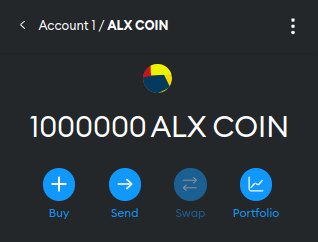
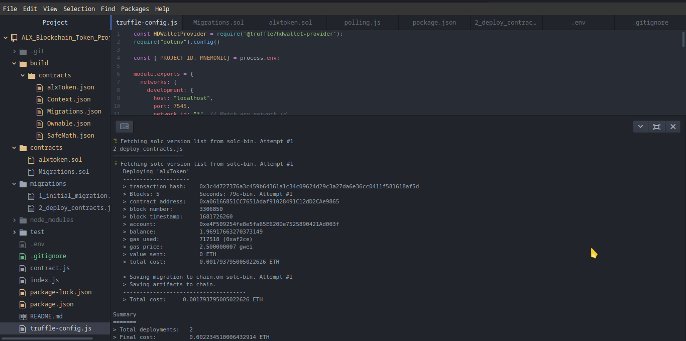

  

# ALX Blockchain Token Project
"ALX Blockchain Token" is a digital token that was created on the Ethereum blockchain. It is a type of cryptocurrency that uses blockchain technology to record transactions and verify the ownership of assets. The token is based on the ERC-20 standard, which allows it to be easily traded on cryptocurrency exchanges and used in decentralized applications (DApps) built on the Ethereum platform. The purpose of the ALX token may vary depending on the project it is associated with, but it generally serves as a means of payment, a reward system, or a governance mechanism for decentralized organizations. The ALX Blockchain Token is just one example of the many tokens that have been created on the Ethereum blockchain to enable innovative new applications and business models in the decentralized finance (DeFi) space.

# Table of contents
- [Installation](#Installation)
- [Usage](#Usage)
- [Troubleshooting](#Troubleshooting)
- [Contributions](#Contributions)
- [Credits](#Credits)
- [License](#License)

# Installation 

This project is build on Node.js serverside framework and therefor for you to run the 
project you must have Node installed. 
1. Run `git clone` to have the repository on the local machine 
2. Run `npm install package.json` to install the necessary packages used in this project. 
3. Create an Alchemy account for Providing the node and API [here](https://auth.alchemy.com/?redirectUrl=https%3A%2F%2Fdashboard.alchemy.com)
4. Create a Metamask account [here](https://metamask.io/) for management of the coin and enable the sepolia test net
5. Get the Sepolia faucets through [here](https://sepoliafaucet.com/)
6. Create the .env file that has the PRODUCT_ID PRODUCT_ID_MAINNET got from Alchemy and MNEMONIC got from Metamask 
7. Run `truffle compile`
8. Run `truffle deploy --network sepolia`
9. Copy the contract address and click on import token on metamask we will have created the ALX COIN

# Usage

The purpose of the ALX token may vary depending on the project it is associated with, but it generally serves as a means of payment, a reward system, or a governance mechanism for decentralized organizations. The ALX Blockchain Token is just one example of the many tokens that have been created on the Ethereum blockchain to enable innovative new applications and business models in the decentralized finance (DeFi) space.

# Troubleshooting
- If you have any issue with installation or usage, you can raise them through my [LinkedIn](https://www.linkedin.com/in/bostone-ochieng-b258a8108/)
or through git pull requests.

# Contributions

This project was build by [Bostone Ochieng](https://www.linkedin.com/in/bostone-ochieng-b258a8108/)

# Credits 
- [Metamask](https://metamask.io/)
- [Sepolia faucet](https://sepoliafaucet.com/)
- [Alchemy](https://auth.alchemy.com/?redirectUrl=https%3A%2F%2Fdashboard.alchemy.com)

# License
This project is licensed under the [MIT License](https://mit-license.org/)

    

